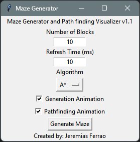
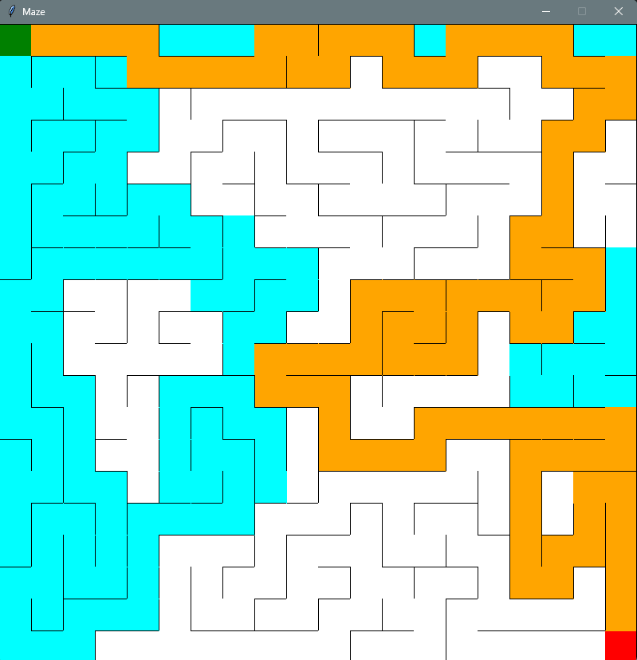

# Maze Generator

## Introduction

Path finding algorithms possess tremendous utility across several fields. Some examples include finding the shortest path between two locations, the distance of concepts in a database, and the constrained exploration of unknown spaces.

To illustrate the behavior of these algorithms, this program generates a 2D maze using a randomized recursive back tracker algorithm. The program is implemented using a stack instead of recursion to circumvent python's recursion limit

Once the maze is generated, either BFS or A* can be used to find the shortest path from start to end.

The maze is illustrated using the tkinter library and can be visualized in real time when the dimensions are below 100 x 100. To provide greater flexibility to the user, a basic user interface is provided which allows for the configuration of parameters in the program.

## User Interface

    

## Maze Illustration

    

